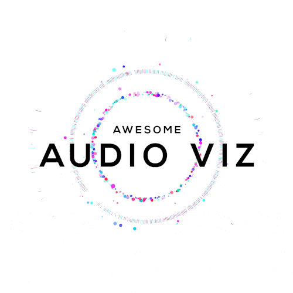

  

- [What is Audio Visualization?](https://en.wikipedia.org/wiki/Music_visualization)

> Music visualization, a feature found in electronic music visualizers and media player software, generates animated imagery based on a piece of music. The imagery is usually generated and rendered in real time and in a way synchronized with the music as it is played.

- [Who made this list?](#authors)
- [Check the logo in action](http://www.shiz.co/aav/)
- [Contributing Guide](Contributing.md)

 

## Table of Contents

- [Books](#books)
- [Downloads](#downloads)
- [Experiments](#experiments)
- [Experiments Codepen](#experiments-on-codepen)
- [Libraries Audio](#libraries-audio)
- [Libraries Visualization](#libraries-visualization)
- [People to Follow](#people-to-follow)
- [Tutorials](#tutorials)
- [Videos](#videos)

## Books

- [Web Audio API by Boris Smus](http://chimera.labs.oreilly.com/books/1234000001552/index.html)

## Downloads

- [Soundwhich](http://soundwhich.com/)
- [Beeple's resource (inspirational C4D "open source" files)](http://www.beeple-crap.com/resources.php)
- [Freesound](http://freesound.org/)
- [Audio Jungle](http://audiojungle.net/)
- [Six Bit Deep](http://www.sixbitdeep.com/shop/)
- [Samplephonics - Free Stuff](http://store.samplephonics.com/collections/free-stuff-1)
- [Wave Alchemy](http://www.wavealchemy.co.uk/free-samples/)
- [Audio Animals](http://www.audioanimals.co.uk/shop-categories/sample-shop)
- [Bed Room Producers Blog](http://bedroomproducersblog.com/free-samples/)
- [Free Music Archive](http://freemusicarchive.org/)
- [Music Radar](http://www.musicradar.com/news/tech/free-music-samples-download-loops-hits-and-multis-627820)
- [How to Make Electronic Music Freebies](http://howtomakeelectronicmusic.com/category/freebies)
- [Motion Sound](http://motionsound.io/)

## Experiments

- [Audible Visuals](https://soniaboller.github.io/audible-visuals/) - Collection of visualizers derived from the Archimedean spiral by Sonia Boller.
- [React Player](https://dazzling-jang-471a34.netlify.com/) - A complete Audio Visualisation player with ReactJS.
- [Moire](http://hughsk.io/moire-1/) - A Web Audio / WebGL visualisation.
- [Finding Love](https://findinglove.activetheory.net/) - fully interactive, Virtual Reality story that transforms emotions into art.
- [Mubert](http://play.mubert.com/en/) - World's first online music composer
- [Tangled](http://netlabelday2016.yarnaudio.com/) - Audio-visual release by Berlin based netlabel Yarn Audio, visuals made in [cables](https://cables.gl/). Drag to rotate, scroll to zoom.
- [Luis Henrique Bizarro Portfolio](https://lhbzr.com/) - Portfolio with experiments using Three.JS and GSLS.
- [Triangles](https://willianjusten.com.br/audio-experiments/triangles/) - An experiment using triangles in Canvas.
- [Adventure Machine](http://www.madeon.fr/adventuremachine/) - Campaign for Madeon's "Adventure" album.
- [BBNG](https://uberviz.io/viz/bbng/) - WebGL Visualizer for "Confessions" (feat. Leland Whitty) by BADBADNOTGOOD.
- [Born in the Echoes](http://bornintheechoes.com/) - Campaign for The Chemical Brothers' "Born in the Echoes" album.
- [Chrome Music Lab](https://musiclab.chromeexperiments.com/) - Play with simple experiments and explore how music works.
- [DENNIS](http://www.dennis.video/) - An interactive and audio responsive music video for "Dennis" by popcorn_10's.
- [Fluctus](http://jojo.ninja/fluctus/) - Experimental 3D Audio Visualizer by Jordan Machado.
- [George & Jonathan III](http://www.georgeandjonathan.com/) - Campaign for George & Jonathan's "III" album.
- [Goy Goy](http://goy-goy.herokuapp.com/) - A multiplayer Chrome Experiment made with HTML5 Canvas, socket.io and audiolet.js.
- [Lantern](https://www.uberviz.io/viz/lantern/) - WebGL Visualizer for "Lantern" by SBTRKT.
- [Lines](http://labs.fluuu.id/lines/) - Visualising Joy Division album cover as a music spectrum by Silvio Paganini.
- [Nero](https://www.uberviz.io/viz/nero/) - WebGL Visualizer for "In The Way" by Nero.
- [OMM](http://ommexperience.com/) - An interactive audio visual experience exploring creativity.
- [Pareidolia](https://www.uberviz.io/viz/pareidolia/) - WebGL Visualizer for "Szerencsétlen" by Venetian Snares.
- [Soundviz](http://work.bartekdrozdz.com/soundviz/) - 5 different sound visualization effects with Leap Motion interactivity.
- [Splice](https://www.uberviz.io/viz/splice/) - A realtime interactive music visualizer using time-code data from Splice's upcoming visualizer API.
- [Typatone](http://www.typatone.com/) - Make music while you write.
- [Yume](http://unseen-music.com/yume/) - Campaign for Helios' "Yume" album.
- [Spins](http://mattdesl.github.io/spins/) - Audio Visualizer rendering Waveforms in Polar Coordinates by Matt DesLauriers.
- [Silk](http://mattdesl.github.io/codevember/21.html) - 3D Audio Visualizer by Matt DesLauriers.
- [Wave](http://mattdesl.github.io/codevember/3.html) - 3D Audio Visualizer by Matt DesLauriers.
- [Binaural](http://mattdesl.github.io/codevember/6.html) - Experiment using Binaural and Reverb audio effects by Matt DesLauriers.
- [Beatgrid](http://mattdesl.github.io/codevember/8.html) - Experiment using Audio Beat Detection by Matt DesLauriers.
- [Party](http://mattdesl.github.io/codevember/13.html) - 2D Audio Visualizer by Matt DesLauriers.
- [Word Problems](https://www.uberviz.io/viz/word-problems/) - WebGL Visualizer for "Word Problems" by Harmonic 313.
- [Here Comes The Sun](http://shiz.co/beatlescode/) - A visual representation of The Beatles' song "Here Comes The Sun" dynamically generated by an algorithm developed with Processing and Processing.js. By Marcio Ribeiro.
- [Audio Cloud](http://ma77os.cc/lab/audio-cloud/) - A reactive particle system based on audio analysis of Fast Fourier Transform spectrum.
- [Glitch](http://naivesound.com/glitch/) - An algorithmic synthesizer to make music from math.
- [105 Birthday Clara Rockmore](http://www.google.com/doodles/clara-rockmores-105th-birthday) - A Doodle for the Birthday of Clara Rockmore.
- [Fireworks with WebGL](http://ondras.github.io/fireworks-webgl/) - Sound driven fireworks by Ondřej Žára.
- [Tonalhub](https://alemangui.github.io/Tonalhub/?user=webaudio&repository=web-audio-api) - Create music from your github repository by Alejandro Mantecon Guillen.
- [Glowsynth - just amazing!](http://outputchannel.com/glowsynth/) - Play with your mouse, Qwerty keyboad, or MIDI keyboard and watch as the lights dance to your music.
- [Mmorph](http://mmorph.massivemusic.com/) - An adventure into new ways of delivering interactive music in the browser and beyond.
- [Play a cornet to Donald Trump](http://trumpdonald.org/) - A funny site to play a cornet to Donald Trump by Animal Agency.
- [Loop Waveform Visualizer](https://airtightinteractive.com/demos/js/reactive/) - WebGL Visualizer for Screw Base by Beytah.
- [Bohemian Rhapsichord](http://static.echonest.com/BohemianRhapsichord/index.html) - A web app that turns the song Bohemian Rhapsody into a musical instrument by Paul Lamere.
- [Scrollsound](http://zya.github.io/scrollsound/) - Scrolling as a method of interaction with audio on the web by Ehsan Ziya.
- [Floraldrift](http://whitevinyldesign.com/floradrift/) - Procedurally generated music and visuals.
- [Experiment #8](http://brunoimbrizi.com/experiments/#/08) - Music Experiment by Bruno Imbrizi.
- [Music Cube](http://www.808cube.com/) - A Chrome Experiment that combines the Roland TR-808 Drum Machine with the Rubik's Cube.
- [Music Game - ECHO](http://tonenotone.com/ECHO/) - A challenging musical puzzle game.
- [Patatap](http://www.patatap.com/) - A portable animation and sound kit.
- [Plink - Awesome Multiplayer Game](http://www.dinahmoelabs.com/plink) - A multiplayer music experience.
- [Simon Says - Game](http://labs.uxmonk.com/simon-says/) - A free memory game in your browser.
- [Soundcloud Visualizer](http://www.michaelbromley.co.uk/experiments/soundcloud-vis/#muse/undisclosed-desires) - A Canvas and Web Audio Experiment.
- [CSS Visualizer](http://likethemammal.github.io/css-visualizer/) - Music Visualizers that are made entirely using DOM elements and CSS3.
- [Kandinski Experiment](http://jasonsigal.cc/kandinskify/) - Music Visualizations inspired in Kandinsky.
- [Visual Music Trailer](https://vimeo.com/160470393) - Live audio visual performance ideas.
- [Draw and Music](http://rugs.grindselect.com/) - Campaign for Rugs new album by Sam Greens.
- [Moogfest Substrate](http://www.moogfest.com/_substrate) - Experimental site to Moogfest.
- [Flame Gradient](http://rickycodes.github.io/audio-visualizer/gradient/) - Audio visualizer built with HTML5 web audio API by rickycodes.
- [3D Grid](http://rickycodes.github.io/audio-visualizer/three/) - Audio visualizer built with HTML5 web audio API by rickycodes.
- [obsidian](http://mrdoob.com/files/temp/xplsv_obsidian/) - 3D Audio Visualization made by the creator of Three.js.
- [TRIF](http://trif.it/) - GIF-based online radio visualization using webaudio API and raw CSS
- [Garbage Collector](http://robertbue.no/playground/webgl/gc-effect/) - Audio visualization experiment made with Three.js and some post-processing.
- [Audiograph](http://audiograph.xyz/) - Amazing audio visualization made by Matt DesLauriers.
- [Happy Monday](http://makiopolis.com/everyday/026/) - Musical experiment using THREE.MeshLine by David Ronai.
- [D159](http://www.simppa.fi/demo/d159/) - Audio visualization for "gloom" shown at NVScene 2015 by Simo Santavirta.
- [Restless Earth](http://restless.earth/) - Audio visualization for "Restless Earth".
- [Scribble Audio](http://scribble.audio/) - Draw loops of sound with this web synthesizer.
- [Touchpianist](http://touchpianist.com/) - play a piano and look all animations along the screen.
- [PartyMode](https://preziotte.com/partymode/) - An experimental music visualizer using d3.js and the web audio api.
- [Arkade London](http://arkade.london/) - Arkade London is a pure personal and experimental webVJ fan art.
- [DJi](http://jieverson.com/DJi/) - Clean music visualizer from SoundCloud or self uploaded.
- [Braille Face: Kōya](https://koya.brailleface.co/) - Navigate a unique interactive environment in your browser while listening to Kōya, the debut album from Melbourne musician Braille Face.
- [VR Ondes Martenot](https://github.com/elifer5000/vr-ondes-martenot) - A playable rendition of the Ondes Martenot in Virtual Reality.
- [Popcorn](http://hughsk.io/popcorn/) - Little audio-reactive sketch by Hugh Kennedy.
- [Beat](http://experiments.kevinboudot.me/canvas-beat/) - Beat is a HTML5 audio/canvas experiment inspired by Propellerheads Figure iOS App.
- [Dancing Torus](http://dancing-torus.s3-website-us-east-1.amazonaws.com/) - Dancing Torus is a WebGL Audio Reactive experience. Choose your favourite song on Soundcloud and start dancing!
- [Musical Interactions](https://tympanus.net/Development/MusicalInteractions/) - Some experimental ideas for playful musical interactions.
- [Polyrhythm](http://www.petervandernoord.nl/polyrhythm/) - An interactive exploration of polyrythmic rhythms.
- [ClubberToy](https://wizgrav.github.io/clubber/) Several shadertoys, rewired with clubber, bundled as a vj app.
- [Andantino](https://alpcanaydin.github.io/andantino/) Listen some notes and try to find same notes on the keyboard.
- [Vissonance](https://tariqksoliman.github.io/Vissonance/) A collection of audio visualizers built in THREE.js.
- [M A I L M A N](http://mailman.acervo.io/) Interactive music video by Bruno Imbrizi for a song called Mailman by Soundgarden.
- [HTML5 Audio Visualizer Video Maker](https://isaiah658.github.io/) Pick your music, background image, customize the visualizer the way you want it, and have the visualizer be recorded all right in your web browser.
- [3d Particles Music Visualiser](https://chardos.github.io/music_viz/) Music visualiser done in Three.js by Richard Tan
- [ShowCQTBar](https://mfcc64.github.io/html5-showcqtbar/) - Audio spectrum visualization with musical scale.
- [Weekly Music Visualizations](https://github.com/surayashivji/WeeklyGraphics) Weekly music visualization experiments built with Three.js and p5.js by Suraya Shivji.
- [Audio Visualizer](https://github.com/Teoxoy/audio-visualizer) - An interesting web audio visualizer built with Pixi.js.
- [CPPN-based Visualizer](https://tkv.io/posts/visualizing-audio-with-cppns) - Applying compositional pattern-producing networks to generate interesting visuals from audio data.
- [YouTube Musical Spectrum](https://github.com/mfcc64/youtube-musical-spectrum) - A browser extension that offers audio visualization on your YouTube page with nice musical notes.
- [Just Dance](http://hiteshsahu.com/AudioAnalysis) - A 3D Audio Visualization made with [BabylonJS](http://babylonjs.com/) & 2D Perlin Noise.
- [audioMotion](https://audiomotion.me) - High-resolution real-time audio spectrum analyzer and full-featured music player written in JavaScript. Includes binaries for Windows, Linux and macOS.
- [p5.js Audio Visualizer](https://amandayehh.github.io/audio-visualizer/) - A powerful, beat- and amplitude-responsive audio visualizer created with [p5.sound](https://github.com/processing/p5.js-sound), on an HTML5 Canvas by Amanda Yeh.

## Experiments on Codepen

- [SVG Animated Drum Kit](http://codepen.io/iamjoshellis/full/KVdQqm/) - Play an amazing Drum made with SVG and realistic sounds by @iamjoshellis.
- [SVG Animated Guitar](http://codepen.io/iamjoshellis/full/qbBKZB/) - Play an amazing Guitar made with SVG and realistic sounds by @iamjoshellis.
- [Audio Visualizer](http://codepen.io/Francext/full/yIogq/) - Abstract Audio Visualizer using Three.js by Francesco Trillini
- [Awesome Audio Player](http://codepen.io/alexpierre/full/RNELPV/) - Radial Audio Player constructed by lines of frequency and amplitude by Alex Permyakov
- [Wireframes](http://codepen.io/pat_hg/full/gamQwr/) - Wireframe WebGL Animation with Three.js by Patrick Heng
- [Soundcloud Vinyl Search](http://codepen.io/chrisgannon/full/GpwqgG/) - An amazing experiment creating a realistic Vinyl player using DrawSVG and GSAP by Chris Gannon.
- [Gooey Effect Audio](http://codepen.io/enjikaka/full/QbJmRJ/) - Upload your mp3 and visualize the song with this crazy effect by Jeremy Karlsson.
- [CSS Audio Visualizer](http://codepen.io/njmcode/full/WbWyWz/) - Using audio frequency data from a hidden video to apply CSS scaling by Neil McCallion.
- [Storytelling with Html5 + CSS3](http://codepen.io/rachelnabors/full/rCost/) - A great example of how to use music to create a Storytelling by Rachel Nabors.
- [Step sequencer](http://codepen.io/woodwork/full/rxrLqa/) - Create music with this sequencer by Joe Harry.
- [WebGL Soundcloud Visualizer using Three.js](http://codepen.io/luigimannoni/full/xbLgqB) - ThreeJS/WebGL Soundcloud player/visualizer based on HTML5 AudioContext API by Luigi Mannoni.
- [Oscilator](http://codepen.io/easwee/pen/sFpmo) - Testing the oscillator node from HTML5 audio API by Anej Gorkič.
- [Cubes Audio Visualizer](http://codepen.io/pat_hg/pen/zvMrRJ) - 10th contribution for codevember 2015 by Patrick Heng.
- [P5 Audio Tests 33](http://codepen.io/laurent-thevenet/pen/JGeXNr) - Audio visualization using p5.js 3D elements and Soundcloud API
- [P5 Audio Tests 27](http://codepen.io/laurent-thevenet/pen/MKJwVd) - Audio visualization using p5.js 3D elements and Soundcloud API
- [CircleLineNERDDISCO](http://codepen.io/TimPietrusky/full/jrPRZR) - Audio visualization with amazing analyser by Tim Pietrusky.
- [Clubberize yin yang example](http://codepen.io/wizgrav/pen/PWKNmg) - An example using the clubberize helper to easily integrate clubber.js in javascript apps.

## Libraries Audio

- [web-audio-analyser](https://github.com/hughsk/web-audio-analyser) - A thin wrapper around the Web Audio API that takes an <audio> element and gives you its waveform/frequency data in return.
- [web-audio-player](https://github.com/Jam3/web-audio-player) - A cross-browser Web Audio player.
- [web-media-playback](https://github.com/hughsk/web-media-playback) - Retrieve playback and buffering information about audio or video playing in the browser.
- [Pizzicato.js](https://alemangui.github.io/pizzicato/) - Simplify the way you create and manipulate sounds via the Web Audio API.
- [ThreeAudio.js](https://github.com/unconed/ThreeAudio.js) - Helps you create music visualizations in Three.js or tQuery.
- [Beeplay.js](https://watilde.github.io/beeplay/) - Write a song In JavaScript.
- [MIDI.js](https://github.com/mudcube/MIDI.js/) - Making life easy to create a MIDI-app on the web.
- [Beep.js](https://github.com/stewdio/beep.js) - A JavaScript toolkit for building browser-based synthesizers.
- [p5.sound](https://github.com/processing/p5.js-sound) - Brings the Processing approach to Web Audio and p5.js.
- [Audiolet](https://www.jhtrnr.com/Audiolet/) - A JavaScript library for real-time audio synthesis and composition.
- [coffee-collider](https://www.npmjs.com/package/coffee-collider) - A language for real time audio synthesis and algorithmic composition in HTML5.
- [audio-render](https://github.com/audio-lab/render) - A pass-through audio stream, providing structure for rendering stream audio data.
- [Octavian](https://github.com/stevekinney/octavian) - Utilities for reasoning about musical notes, frequencies, and intervals
- [waveform-data](https://www.npmjs.com/package/waveform-data) - Audio Waveform Data Manipulation API – resample, offset and segment waveform data in JavaScript.
- [audiowaveform](https://github.com/bbc/audiowaveform) - C++ program to generate waveform data and render waveform images from audio files.
- [Aubio](https://aubio.org) - C library for realtime audio labeling with bindings for Python and PD, support for ofx and Vamp.
- [audio](https://github.com/go-audio/audio) - Generic Go package designed to define a common interface to analyze and/or process audio data
- [wav](https://github.com/go-audio/wav) - Battle tested Wav decoder/encoder
- [standardized-audio-context](https://github.com/chrisguttandin/standardized-audio-context) - A cross-browser implementation of the AudioContext which aims to closely follow the standard.
- [web-audio-beat-detector](https://github.com/chrisguttandin/web-audio-beat-detector) - A beat detection utility which is using the Web Audio API.

## Libraries Visualization

- [p5.js](http://p5js.org/) - A JavaScript library for creating graphic and interactive experiences, based on the core principles of Processing.
- [Pixi.js](https://github.com/pixijs/pixi.js/) - A fast lightweight 2D library that works across all devices. The Pixi renderer allows everyone to enjoy the power of hardware acceleration without prior knowledge of WebGL.
- [sketch.js](http://soulwire.github.io/sketch.js/) - Let's you get straight to the fun parts of creative coding, without ever having to worry about shims or boilerplate code.
- [three.js](http://threejs.org/) - Three.js is a library that makes WebGL easy to use.
- [Two.js](https://jonobr1.github.io/two.js/) - A two-dimensional drawing API geared towards modern web browsers. It is renderer agnostic enabling the same API to draw in multiple contexts: SVG, Canvas, and WebGL.
- [BabylonJS](http://babylonjs.com/) - A complete JavaScript framework for building 3D games with HTML5, WebGL and Web Audio.
- [Web Audio Extension](https://github.com/spite/WebAudioExtension) - A Chrome extension to play with Web Audio.
- [Cinder](https://libcinder.org/) - A community-developed, free and open source library for professional-quality creative coding in C++.
- [Processing](https://www.processing.org/) - An open source programming language and integrated development environment built for the electronic arts, new media art, and visual design communities.
- [HYPE_processing](http://www.hypeframework.org/) - Collection of Processing classes that performs heavy lifting tasks while using a minimal amount of code writing.
- [The Force](https://github.com/shawnlawson/The_Force) - Live coded shader editing with audio input.
- [Hylogen](https://github.com/sleexyz/hylogen) - Purely functional language embedded in Haskell for expressive live coding of fragment shaders (with audio input).
- [Peaks.js](https://www.npmjs.com/package/peaks.js) - Modular client-side JavaScript component designed for the display of and interaction with audio waveform material in the browser.
- [Clubber.js](https://github.com/wizgrav/clubber) - Application of music theory in audio reactive visualizations.
- [Vuo](https://vuo.org) — A realtime visual programming language for interactive media.
- [wavesurfer.js](https://wavesurfer-js.org/) - A customizable audio waveform visualization, built on top of Web Audio API and HTML5 Canvas
- [wavebell](https://github.com/skylerlee/wavebell) - A javascript voice recorder with realtime waveform, using web microphone
- [Circular Audio Wave](https://github.com/kelvinau/circular-audio-wave) - A JS library for audio visualization in circular wave using Web Audio API and ECharts
- [Slang](https://github.com/kylestetz/slang) - An audio programming language built in JS
- [audioMotion-analyzer](https://www.npmjs.com/package/audiomotion-analyzer) - High-resolution real-time audio spectrum analyzer JS module with no dependencies.

## People to Follow
- [Aaron Koblin](http://www.aaronkoblin.com/) - Artist, designer, programmer, and entrepreneur specializing in data and digital technologies.
- [Joshua Davis](http://www.joshuadavis.com/) - An American designer, technologist, author and artist in new media.
- [Robert Hodgin](http://roberthodgin.com/) - A creative coder living in Brooklyn. Co-creator of the Cinder C++.
- [Seb Lee-Delisle](http://seb.ly/) - An award-winning digital artist and speaker.
- [Raven Kwok](http://ravenkwok.com/) - A visual artist, animator and creative programmer.
- [Chris Wilson](https://github.com/cwilso/) - Open Web Guy, formerly of Microsoft and now working as a Developer Advocate at Google.
- [Jason Sigal](https://github.com/therewasaguy) - Creative Coder in residence at NYU's and creator of web audio library for p5.js.
- [Shawn Lawson](http://shawnlawson.com/) - An experiential media artist creating the computational sublime.
- [Matt DesLauriers](https://github.com/mattdesl) - Creative coder at Jam 3.
- [Patrick Heng](http://hengpatrick.fr/) - Creative front-end developer. Studied at Hetic and Gobelins and works at Grouek.
- [Mat Preziotte](https://preziotte.com/) - Absurd music visualizations and generative art.
- [Yannis Gravezas](https://github.com/wizgrav) - A creative coder with several projects featured in chrome experiments, fwa and elsewhere.

## Tutorials

- [Kadenze - Courses about Sound and Creative Process](https://www.kadenze.com/courses)
- [MDN - Basic concepts behind Web Audio API](https://developer.mozilla.org/en-US/docs/Web/API/Web_Audio_API/Basic_concepts_behind_Web_Audio_API)
- [Understanding AudioParams: Precision control of web audio nodes](http://www.soundesign.info/2016/02/07/understanding-audioparams-precision-control-web-audio-nodes/)
- [Making An Interactive Music Video With WebGL](https://medium.com/@superhighfives/making-a-music-video-f60757ceb4cf#.j72rbcxgk)
- [Exploring the web audio api with d3](http://blog.scottlogic.com/2016/01/06/audio-api-with-d3.html)
- [Getting Started with Web Audio API](http://www.html5rocks.com/en/tutorials/webaudio/intro/)
- [14 essential JavaScript audio libraries for web developers](http://codecall.net/2014/01/29/14-essential-javascript-audio-libraries-for-web-developers/)
- [Learning Web Audio API](http://blog.sonoport.com/post/120993888887/learningwebaudioapi)
- [Fun with Web Audio API](http://codepen.io/DonKarlssonSan/post/fun-with-web-audio-api)
- [The Audio Processing Dog House](https://www.objc.io/issues/24-audio/audio-dog-house/)
- [Web Audio School](http://mmckegg.github.io/web-audio-school/)
- [Audio visualisation with the web audio api](http://fourthof5.com/audio-visualisation-with-the-web-audio-api)
- [Make Your Browser Dance](https://24ways.org/2013/make-your-browser-dance/)
- [Audio Visualization with Web Audio and Three.js](http://raathigesh.com/Audio-Visualization-with-Web-Audio-and-ThreeJS/)
- [Applying Web Audio API with the HTML5 Canvas Element - Part I](https://sonoport.github.io/web-audio-and-canva-partI.html)
- [Applying Web Audio API with the HTML5 Canvas Element - Part II](https://sonoport.github.io/web-audio-and-canva-partII.html)
- [Real-time analysis of streaming audio data with Web Audio API](http://ianreah.com/2013/02/28/Real-time-analysis-of-streaming-audio-data-with-Web-Audio-API.html)
- [Syncing CSS Animations with HTML5 Audio](http://www.sitepoint.com/syncing-css-animations-with-html5-audio/)
- [Javascript Systems Music - Learning Web Audio by Recreating The Works of Steve Reich and Brian Eno](http://teropa.info/blog/2016/07/28/javascript-systems-music.html)
- [Creative Audio Visualizers](https://tympanus.net/codrops/2018/03/06/creative-audio-visualizers/?utm_source=feedburner&utm_medium=feed&utm_campaign=Feed%3A+tympanus+%28Codrops%29)
- [Recreating legendary 8-bit games music with Web Audio API](https://codepen.io/gregh/post/recreating-legendary-8-bit-games-music-with-web-audio-api)
- [Visualizing sound in Go with SDL](https://mlesniak.com/post/2018/09/13/go-guitar-/-visualize-sound/)

## Videos

- [Matt McKegg: I Play The JavaScript - JSConf.Asia 2015](https://www.youtube.com/watch?v=NL0nb8A8FDM)
- [Chris Lowis: A Brief History of Synthesis with the Web Audio API](https://www.youtube.com/watch?v=d8TCq0xLnV4)
- [Introducing the Web Audio API](https://www.youtube.com/watch?v=_ZUhicr-R-g)
- [CorkDev.IO - HTML 5 Web Audio API](https://www.youtube.com/watch?v=vIKijPAW9Js)
- [Steve Kinney: Building a musical instrument with the Web Audio API | JSConf US 2015](https://www.youtube.com/watch?v=56spBAgOYfg)
- [Making the Web Rock: The Web Audio API](https://www.youtube.com/watch?v=wZrNI-86zYI)
- [Jordan Santell: Signal Processing with the Web Audio API - JSConf2014](https://www.youtube.com/watch?v=YBQ5pzvgbOE)
- [Making waves using the Web Audio API](https://www.youtube.com/watch?v=oHBx_kMmsRE)
- [Stuart Memo: JavaScript is the new Punk Rock](https://www.youtube.com/watch?v=PN8Eg1K9xjE)
- [Jan Krutisch: JavaScript Patterns For Contemporary Dance Music -- JSConf EU 2013](https://www.youtube.com/watch?v=X41IwSyU-BM)
- [Charlie Roberts: Gibbering at Algoraves - JS in Live Audiovisual Performances - JSConf.Asia 2014](https://www.youtube.com/watch?v=2BIOINFSbMg)
- [Lauren McCarthy: Learning while making p5js](https://www.youtube.com/watch?v=1k3X4DLDHdc)
- [Interactive Music with Tone.js](http://medias.ircam.fr/x9d4352)
- [Web Audio API vs Native: Closing the Gap](http://medias.ircam.fr/x2af2f6)
- [BRAID: A Web Audio Instrument Builder with Embedded Code Blocks](http://medias.ircam.fr/xa87b09)
- [Web Audio Tools](http://medias.ircam.fr/x32ba00)
- [HTML5DevConf: Jordan Santell, "Browser Dance Party: Visualizing Audio with the Web Audio API"](https://www.youtube.com/watch?v=TdgBAhGmoH4)
- [Praveen Kumar - MIDI.js](https://www.youtube.com/watch?v=xw86fXq2cKM)
- [Mathieu 'p01' Henri: Making Realtime Audio-Visuals - JSConf.Asia 2015](https://www.youtube.com/watch?v=16oLi1kvLHs)
- [Paul Adenot: Elements of Dance Music - JSConf.Asia 2015](https://www.youtube.com/watch?v=Ww0jTafmd_w)
- [8-bit Music Theory](https://www.youtube.com/channel/UCeZLO2VgbZHeDcongKzzfOw)

## Contributing

Your contributions are always welcome! [Click here to read the guidelines](https://github.com/willianjusten/awesome-audio-visualization/blob/master/Contributing.md).

## Authors

|                 |  | 
|:---------------------:|:-------------------:|:-------------------:|
|  [Willian Justen](https://github.com/willianjusten/)   |     [Luis Henrique](https://github.com/lhbzr)    |    [Márcio Ribeiro](https://github.com/marcioshiz)

## License

To the extent possible under law, [Willian Justen](http://github.com/willianjusten) has waived all copyright and related or neighboring rights to this work.
